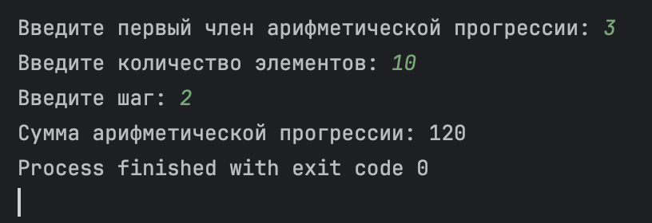
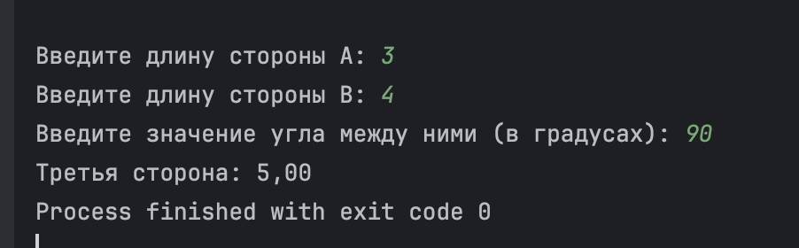
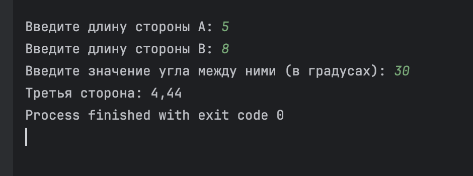
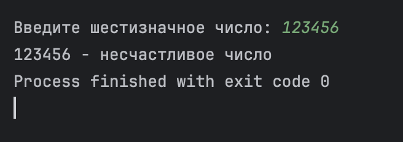
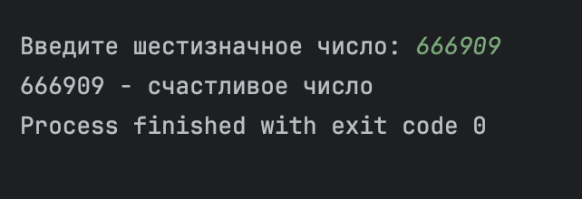
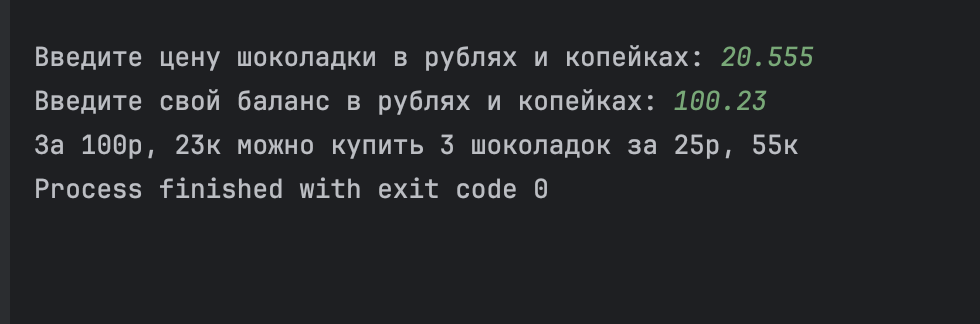
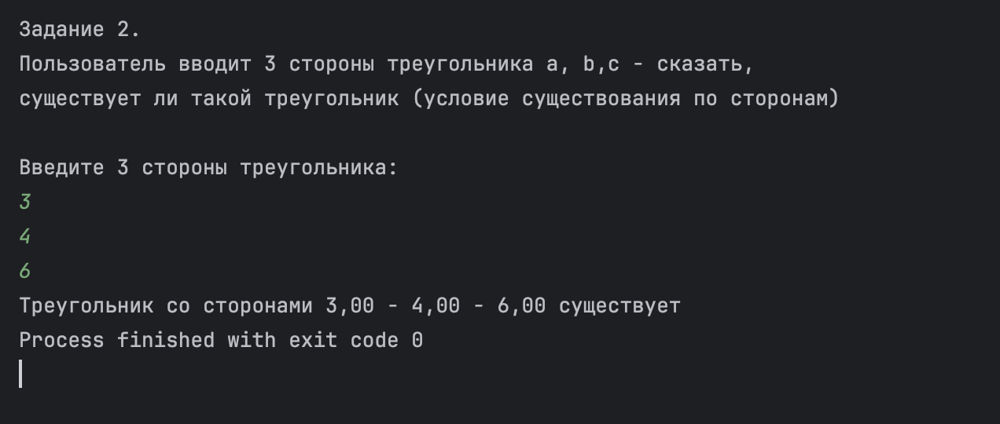
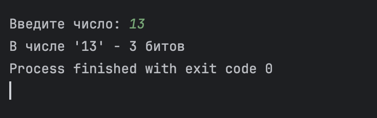
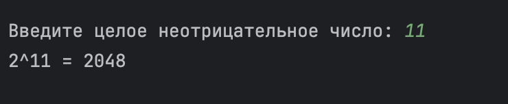
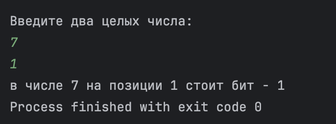

# Задания.
## Уровень 1 – Стажёр
### Задание 1.
Пользователь вводит первый член арифметической прогрессии, 
кол-во элементов в прогрессии, а также шаг между двумя соседними 
членами прогрессии. Найти сумму всех членов этой прогрессии от 
первого до последнего, введенного пользователем. Циклы использовать нельзя.

---

### Задание 2. 
Пользователь вводит две стороны произвольного треугольника и 
значение угла между ними. Необходимо найти третью сторону по 
теореме косинусов (см. в интернете). Проверить для прямоугольных 
и непрямоугольных треугольников, использовать проверку через онлайн-калькулятор.

---

### Задание 3. 
Пользователь вводит шестизначное число. Оно считается счастливым если 
суммы первых трех цифр и последних трех равны. Вывести информацию о том,
является ли введенное число счастливым.

---

## Уровень 2 – Джун
### Задание 1.
Пользователь вводит стоимость шоколадки (в рублях и копейках) а также 
кол-во денег у него в кармане (в рублях и копейках). Программа должна 
посчитать, сколько шоколадок может купить пользователь, и какая у него 
останется сдача, если он купит максимальное кол-во шоколадок. Все вычисления 
делать в целочисленных типах. При вводе значений копеек больше 100 делать 
приведение к канонической форме либо выводить ошибку.

---

### Задание 2. 
Пользователь вводит 3 стороны треугольника a, b,c - сказать, существует ли
такой треугольник (условие существования по сторонам)

---

## Уровень 3 – Джун плюс плюс
### Задание 1.
Пользователь вводит число int, необходимо посчитать количество битов, равных
единице в этом числе не используя циклы.

---

### Задание 2.
Пользователь вводит целое неотрицательное число.  Необходимо возвести число 2 
в степень, равную этому числу. Циклы использовать нельзя. Переполнения не обрабатывать.

---

### Задание 3.
Пользователь вводит 2 числа – a, b. Необходимо сказать, какой бит стоит на позиции
b в числе a. Циклы использовать нельзя. Позиция битов отсчитывается по разрядам 
числа – справа-налево начиная с нуля (нулевой разряд).

---

> **Критерии оценки:**
> 
> - **Стажёр** + 8 баллов
> - **Джун** + 2 балла
> - **Джун++** + 2 балла
> 
> _Сделать можно от 1 до 3х пунктов._
